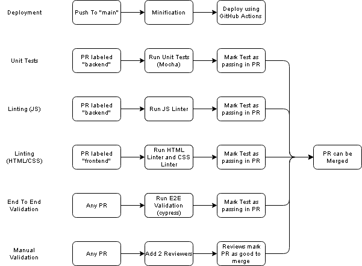

# CI/CD Phase 1

## Overall Pipeline Architecture

Rather than create one large pipeline with many steps which increases complexity, we decided to create many small independent pipelines which work in parallel to conduct code quality checking. Using this strategy, if any one pipeline has issues, we can still continue development without delay, and the quality of code is likely to remain high.

## Overview of Pipeline Features

We've identified 5 major features which we definitely want to implement in the CI/CD pipeline.

-   Deployment
-   Unit Testing
-   Linting
-   End To End Validation
-   Manual Validation

We created this diagram to demonstrate our strategy of multiple simple pipelines.

## Finished Features and Implementation

So far the features listed below have been completed to some degree:

-   Deployment
    -   Implemented: action triggered on any push to main, uses the github pages action to publish the app
    -   ToDo: Add minifications ste between trigger and github pages action
-   Unit Testing
    -   Implemented: action triggers on any PR, uses mocha to perform unit testing on core components
    -   ToDo: trigger workflow only on certain PRs which relate to JS code
-   Linting (JS)
    -   Implemented: ction triggers on any PR, uses eslint to perform style enforcement on all JS components
    -   ToDo: trigger workflow only on certain PRs which relate to JS code
-   Linting (HTML)
    -   Implemented: action triggers on any PR, uses HTMLhint to perform style enforcement on all HTML components
-   Linting (CSS)
    -   Implemented: action triggers on any PR, uses Stylelint to perform style enforcement on all CSS components

## Planned Features and Timeline
